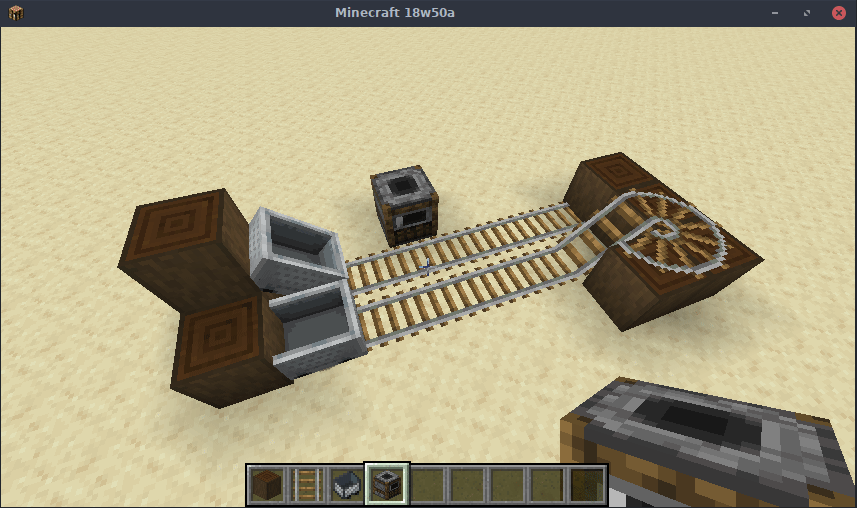

# Old Boosters -- Fabric Edition
*A simple mod utilizing mixins to reenable the old minecart boosters from Alpha*

Licensed under the MIT license.

## Features
 - The booster bug can be turned on an off on a per-minecart basis.
 - ~~There's a config setting to change what newly placed minecarts are.~~
   - This is not currently true, as config is not implemented in the port.
   - You can bypass the ~~setting~~ default by using an NBT tag, e.g. `/summon minecraft:minecart ~ ~ ~ {EnableBoosters: true/false}`

Based off of @Exalm's [olddays](https://github.com/Exalm/Minecraft-mods) mod
and @jpmac26's [OldDaysRevisited](https://github.com/jpmac26/OldDaysRevisited)
